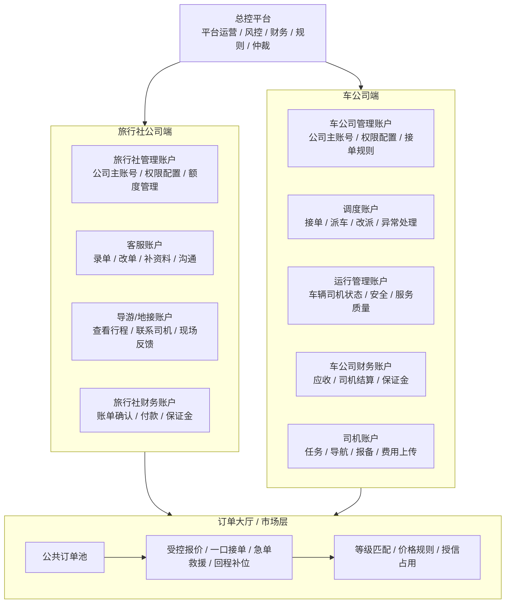
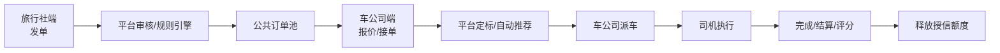

# 平台层级管理与订单大厅规划

## 1. 平台总体层级图



## 2. 总控平台职责

总控平台是整个系统的最高管理层，不直接代表任何旅行社或车公司。

核心职责：

- 管理旅行社公司与车公司入驻、停用、认证担保、保证金和授信额度。
- 配置订单大厅规则：路线价格、保护起拍价、报价区间、急单加价、回程补位价、等级匹配规则。
- 配置账号套餐：每个公司免费账号数量、超额账号收费规则、不同角色可开通的功能。
- 管理客诉仲裁：证据收集、责任归因、扣分、赔付、保证金冻结和解冻。
- 管理结算：旅行社应付、车公司应收、司机费用、平台服务费。
- 管理风控：乱发单、不结算、恶意低价、接单后取消、绕开平台交易。
- 管理系统审计：所有报价、定标、改价、扣分、冻结、权限变更都要留痕。

总控平台后台需要配置：

- 公司管理：旅行社、车公司、等级、状态、联系人、认证资料。
- 账号管理：公司主账号、子账号数量、角色、权限、停用。
- 授信与保证金：现金保证金、系统认证担保、授信额度、已占用额度、可用额度。
- 订单大厅规则：定价、保护价、报价次数、报价冷却、自动/人工定标。
- 等级评分规则：旅行社等级、车公司等级、司机服务记录、责任归因。
- 客诉仲裁规则：证据类型、处理时限、赔付上限、申诉流程。
- 收费套餐：免费账号数量、超额账号单价、功能模块开关。
- 审计日志：谁在什么时间做了什么操作，操作前后数据是什么。

## 3. 旅行社公司端

旅行社公司端只负责发单、维护订单、沟通、确认结算和处理客诉，不负责安排车辆。

### 3.1 旅行社管理账户

公司主账号，拥有本旅行社端最高权限。

功能：

- 管理公司资料、联系人、结算信息、保证金和授信额度。
- 新增、停用、编辑公司内部账号。
- 给客服、导游、财务配置权限。
- 查看本公司全部订单、账单、客诉、额度占用。
- 设置内部审批规则，例如高金额订单需要管理账户确认。

权限示例：

- 全部订单查看。
- 新建/修改/取消订单。
- 子账号管理。
- 财务查看和确认。
- 客诉处理。
- 平台沟通。

### 3.2 客服账户

客服账户主要用于日常录单、改单、补资料和沟通。

功能：

- 上传订单。
- 修改未成交或允许修改的订单。
- 补充航班、酒店、客人联系人、人数、行李、备注。
- 与平台客服、车公司调度沟通。
- 查看自己创建或被授权查看的订单。
- 提交异常说明和客诉材料。

可配置权限：

- 是否允许发单。
- 是否允许修改价格。
- 是否允许取消订单。
- 是否允许查看结算金额。
- 是否允许查看车公司信息。
- 是否允许发起客诉。
- 是否只能看自己创建的订单。

### 3.3 导游/地接账户

导游账户服务于现场执行，不参与订单价格和竞价。

功能：

- 查看被分配行程。
- 查看日期、线路、客人信息、集合点、航班、酒店。
- 查看成交后司机姓名、电话、车辆信息和车牌。
- 与司机或车公司调度联系。
- 上传现场反馈：客人迟到、临时改点、超行李、未见客、行程变更。
- 提交服务确认，帮助平台判断责任归因。

可配置权限：

- 是否显示客人完整联系方式。
- 是否显示司机电话。
- 是否允许修改集合点。
- 是否允许提交现场异常。
- 是否允许确认服务完成。

### 3.4 旅行社财务账户

功能：

- 查看本旅行社账单。
- 确认订单完成。
- 发起付款或上传付款凭证。
- 查看保证金、授信额度、已占用额度。
- 查看赔付、扣款、退款和冻结记录。

限制：

- 不默认允许修改订单服务内容。
- 不默认允许管理客服和导游账号。

## 4. 车公司端

车公司端负责看订单大厅、报价/接单、派车、运行管理、司机执行和结算。

### 4.1 车公司管理账户

公司主账号，拥有本车公司最高权限。

功能：

- 管理公司资料、车辆、司机、资质、保证金、授信额度。
- 配置调度、财务、运行管理、司机账号。
- 查看订单大厅、报价记录、中标订单、执行状态。
- 设置接单规则：接哪些地区、车型、时间、语言、回程单。
- 查看评分、等级、客诉和仲裁记录。

### 4.2 调度账户

功能：

- 查看订单大厅。
- 提交报价、一口接单、申请回程补位价。
- 成交后分配司机和车辆。
- 改派车辆和司机。
- 上报异常：堵车、事故、车辆故障、司机迟到。
- 与平台和旅行社客服沟通。

可配置权限：

- 是否允许报价。
- 是否允许一口接单。
- 是否允许超过建议价申请加价。
- 是否允许改派司机车辆。
- 是否允许处理急单救援。

### 4.3 运行管理账户

功能：

- 查看车辆状态、司机状态、任务执行状态。
- 管理安全、车况、保险、年检、司机证件。
- 监控迟到风险和异常报备。
- 处理服务质量问题。
- 维护司机服务记录。

### 4.4 车公司财务账户

功能：

- 查看车公司应收账款。
- 查看订单结算、平台服务费、赔付扣款。
- 管理司机费用、司机垫付、司机代收。
- 查看保证金冻结、扣款、解冻记录。

### 4.5 司机账户

司机账户是执行端。

功能：

- 查看已分配任务。
- 查看上车点、下车点、时间、航班、客人联系人。
- 导航、联系导游或客人。
- 上传到达、接到客人、完成、异常、费用凭证。
- 提交堵车、事故、客人迟到、超行李、临时改点等证据。

限制：

- 不允许查看订单大厅。
- 不允许报价。
- 不允许查看旅行社结算价。
- 不允许管理公司其他账号。

## 5. 账号数量与收费规则

每个公司端口可以配置一定数量的免费账号，超出后按账号或套餐收费。

建议规则：

| 公司类型 | 免费账号建议 | 超额收费对象 |
|---|---:|---|
| 旅行社公司 | 1 个管理账户 + 3 个客服/导游/财务账户 | 超额客服、导游、财务账户 |
| 车公司 | 1 个管理账户 + 3 个调度/财务/运行账户 + 若干司机账户 | 超额管理类账户，司机账户可按规模套餐 |

计费原则：

- 管理账户免费数量有限。
- 司机账户可以按车队规模给免费额度，例如前 10 个司机免费。
- 超额账号按月计费。
- 高级功能可单独收费，例如自动报价、批量导入、API 对接、财务导出、智能派单。
- 停用账号不计费，冻结账号视业务规则决定是否计费。

## 6. 授信与保证金额度

保证金不是单纯押金，而是发单或接单的授信额度。

旅行社示例：

```text
旅行社缴纳保证金：¥100,000
可同时发布未结算订单总额：¥100,000
已发布未结算订单：¥38,000
可用额度：¥62,000
订单完成并支付车公司：释放对应订单额度
```

系统认证担保：

- 总控平台可以给优质公司开启系统认证担保。
- 认证担保公司可以免缴现金保证金。
- 但必须设置授信额度、担保人、审批人、有效期和风控备注。
- 免保证金不等于无限发单或无限接单。

额度占用规则：

- 旅行社发单后，根据订单预算或成交价占用额度。
- 订单取消且无责任赔付时释放额度。
- 订单完成但未付款时继续占用额度。
- 订单完成并支付给车公司后释放额度。
- 客诉或仲裁中订单可进入部分冻结状态。

## 7. 订单大厅位置

订单大厅位于平台层，不属于某一家旅行社或车公司。



订单大厅负责：

- 接收多个旅行社发布的订单。
- 根据平台规则生成建议价、保护价、可报价区间和服务等级。
- 向符合条件的车公司展示订单。
- 支持受控报价、一口接单、急单救援、回程补位。
- 隐藏其他车公司的具体报价。
- 根据等级、评分、价格、ETA 和风控规则推荐成交方。

订单大厅不应该做：

- 不允许无限低价竞拍。
- 不允许直接公开所有报价。
- 不允许低于保护价报价。
- 不允许无保证金或无授信额度的公司无限发单。
- 不允许未通过资质或等级限制的车公司接高风险订单。

## 8. 订单大厅规则

### 8.1 标准订单

- 旅行社发单，平台生成建议价和保护价。
- 车公司只能在允许区间报价。
- 不公开其他公司具体报价。
- 不默认最低价中标。
- 平台按综合评分推荐，初期建议人工定标。

### 8.2 一口接单

- 平台或旅行社设置一口接单价。
- 符合等级、保证金、车型、语言、地区条件的车公司可以直接接单。
- 接单后锁定订单。

### 8.3 急单救援

- 适用于事故、车坏、堵车、司机无法执行、临时补车。
- 急单不按低价竞拍。
- 优先 ETA、车辆可用性、服务等级和历史履约。
- 可高于标准价。
- 责任归因影响赔付和扣分。

### 8.4 回程补位

- 车公司已有前序订单，需要回程或顺路补位。
- 可低于标准保护价，但必须证明路线和时间合理。
- 不计入恶意低价统计。
- 不能影响前序订单服务。

## 9. 端口联动关系

### 9.1 旅行社与平台

- 旅行社提交订单。
- 平台审核订单、价格和额度。
- 平台发布到订单大厅。
- 平台反馈报价、中标、异常和结算状态。

### 9.2 平台与车公司

- 平台推送订单池。
- 车公司报价或接单。
- 平台判断报价是否符合规则。
- 成交后车公司进入派车流程。
- 平台追踪执行、异常、证据和结算。

### 9.3 旅行社与车公司

- 成交前原则上不直接暴露完整联系方式。
- 成交后根据权限开放必要联系信息。
- 沟通内容应尽量在平台内留痕。
- 客诉时双方上传证据，平台仲裁。

### 9.4 车公司与司机

- 车公司内部派车。
- 司机执行任务、上传报备和证据。
- 司机异常反馈影响车公司运行评分，但平台也要记录客人和旅行社责任。

## 10. 权限配置建议

权限应按角色配置，而不是写死。

基础权限项：

- 查看订单。
- 新建订单。
- 修改订单。
- 取消订单。
- 查看价格。
- 查看结算。
- 上传证据。
- 发起客诉。
- 处理客诉。
- 报价。
- 一口接单。
- 派车。
- 改派。
- 查看司机联系方式。
- 查看客人联系方式。
- 管理账号。
- 管理保证金和授信。

权限配置原则：

- 公司主账号可以配置本公司子账号。
- 平台可以限制公司可开通的角色和数量。
- 高风险权限需要二次确认或平台审核。
- 财务权限和操作权限要分离。
- 导游、司机等执行账号不应看到完整财务信息。

## 11. 推荐上线顺序

第一阶段：规划和静态原型

- 完成平台层级、权限、订单大厅、保证金、评分、仲裁规则文档。
- 完成旅行社端、车公司端、平台端页面 demo。

第二阶段：新增数据层和 API

- 新增公司账号体系。
- 新增订单大厅表。
- 新增报价、定标、授信、保证金、客诉仲裁表。
- 不破坏现有订单和派车表。

第三阶段：灰度试运行

- 旅行社可以发单。
- 车公司可以只读订单大厅。
- 平台人工发布和人工定标。
- 评分和保证金先记录，不自动扣罚。

第四阶段：开放受控报价

- 开放区间报价。
- 开放一口接单。
- 开放回程补位申请。
- 开放急单救援。

第五阶段：启用风控和收费

- 启用账号超额收费。
- 启用授信额度强校验。
- 启用客诉仲裁扣分。
- 启用保证金冻结和赔付。

## 12. 核心结论

这个平台应当是：

- 总控平台管理规则和风控。
- 多旅行社公司独立发单。
- 多车公司共享订单池。
- 订单大厅属于平台市场层。
- 旅行社和车公司都有等级、保证金、授信和账号体系。
- 子账号权限由公司主账号配置，但受平台套餐和风控限制。
- 低价不是唯一逻辑，等级、信用、服务和责任归因才是核心。
